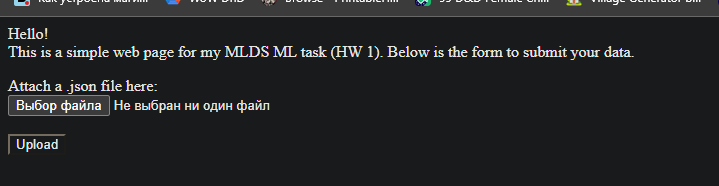
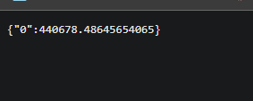
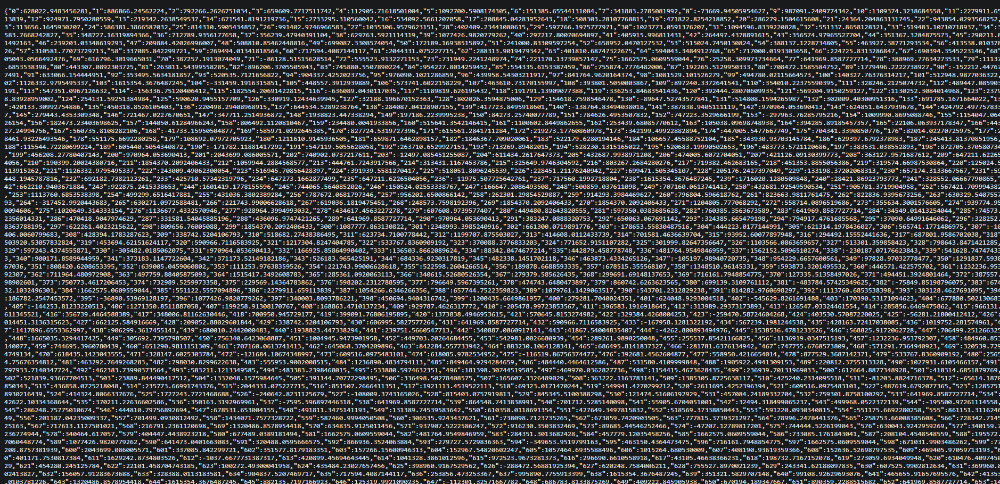

# Великое описание великой домашки

В целом я жестко шел по заданию, а это значит дефолтный пайплайн:
1. Посмотреть на данные, заполнить пропуски, дропнуть NaN-ы, привести
в порядок некоторые колонки, сделать скейлинг. Про категориальный считай что тут сделал.
2. Взять несколько моделей, покрутить их гиперпараметры (странно,
что не `optuna`-ой..).
3. Посчитал метрику, поплакал что она маленькая.
4. Завернул все действия по изменениям данных в один класс. Он, кстати,
лежит в `pipeline.py`. Фитанул его на обучающей выборке, сохранил.
5. Поднял сервис на фастапи, сделал небольшую форму для отправки данных.
6. Прикрутил сохраненные ранее параметры модели и класс по предобработке к фастапи. Профит.

Результаты на каждом этапе.. Ну сомнительные. Хз почему, но
модель работает довольно отвратно (ну наверное потому что они линейные все Сережа..)
и вообще как-то куце. Радует, что как только появились категориальный, R2 вроде подрос,
но все равно плохо. Надо бы менять модели, но тут у нас не просят такое.

Не вышло сделать инжиниринг фичей (потому что я ненавижу сий процесс), но зато
получилось немного поразбираться в фастапи и сделать гуи. В целом было забавно
первый раз в жизни подумать о том как деплоить модельку (потому что рабочего опыта нет ыех)
так что спасибо этой домашке за это.

## Фоточки

### GUI для загрузки (рут)

### Загрузили .json

### Загрузили .csv

Выглядит ужасающе, но на табличку красивую меня уже не хватило.